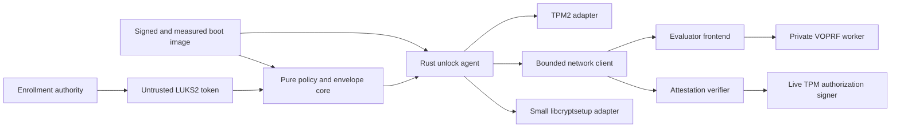

# Rust NBDE: TPM2, LUKS2, and attested enrollment

Design proposal, 22 September 2026. This document does not claim an implementation or a security proof.

## 1. Recommendation and scope

Build a new Rust NBDE system with a small core that can be verified. Give the network cryptographic service a limited interface. Define explicit enrollment and boot policies.

Keep threshold composition. Keep encrypted disks separate from remote key material. Support only Linux, TPM 2.0, LUKS2, and one modern cryptographic profile with an explicit version.

Do not implement Clevis/Tang wire compatibility, JOSE, JWT, or shell-based cryptography. Do not support TPM1, LUKS1, or arbitrary executable plugins.

Use online enrollment as an explicit design choice. This permits an RFC-specified verifiable oblivious pseudorandom function (VOPRF) instead of a new variant of the Tang exchange. It prevents offline enrollment with only a public key. It does not require the client to send a LUKS credential or disk volume key to a server.

Support two production modes, selected in the signed enrollment policy:

| Mode | Automatic unlock requirements | Intended use |
|---|---|---|
| `network-bound` | Approved local measured boot, this TPM, and sufficient configured network factors | Critical infrastructure that must start without the fleet attestation control plane |
| `attested` | The same local protection, a fresh remote boot appraisal, and TPM authorization bound to the session | Ordinary production workloads |

Do not change modes automatically after a timeout. A mode change requires a new authorized enrollment.

A separate `bootstrap-local` profile can start the minimum infrastructure that the two production modes need. Keep this profile tightly limited. Its use is an explicit availability decision. Do not use it as a hidden fallback.

The first product manages disk credentials. The initial release excludes arbitrary file encryption, streaming data encryption, remote command execution, and runtime workload attestation.

## 2. What the existing failures teach us

Tang uses JOSE JWK/JWS objects. Clevis uses JWE. These formats do not constitute JWT bearer-token authentication.

The formats permit flexible parsing and algorithm selection. This flexibility can cause unnecessary complexity. A change to the encoding alone does not establish better security.

Two concrete upstream failures motivate architectural requirements:

* CVE-2021-4076 caused an advertisement lookup to return a private exchange JWK. The code path expected a public signed advertisement. The fix separated the signing path from generic key lookup. This failure crossed type and authority boundaries. Memory-safe code can cause the same failure. [Upstream fix](https://github.com/latchset/tang/commit/e82459fda10f0630c3414ed2afbc6320bb9ea7c9).
* CVE-2023-1672 concerned key-file permissions at creation, before a later restrictive chmod. The new system creates secret files with restrictive permissions at the first open. It must not depend on a later permission repair. [Upstream key-creation fix](https://github.com/latchset/tang/commit/8dbbed10870378f1b2c3cf3df2ea7edca7617096).

The review used local reference checkouts of Clevis `1c9e927587918ef009503b39a504ef2a5d02c4fb` and Tang `97cffa4e2b7e60c7f363571a2acdf596effac575`. These observations do not constitute a complete audit. They do not establish the number of historical vulnerabilities.

## 3. Security model

### Assets and authorities

Protect the LUKS slot credential, reconstructed policy secret, individual shares, and TPM wrapping seeds. Protect VOPRF private keys, device credentials, and signing keys for enrollment and boot authorization.

Keep these authorities separate: fleet membership, software-release approval, envelope signing, live attestation decisions, VOPRF evaluation, and human recovery. One process must not implicitly acquire all these authorities.

### Adversaries in scope

Assume that an attacker can read and change the disk header. The attacker can copy ciphertext and replay historical headers and policy files. The attacker can control DNS and the network, send arbitrary protocol inputs, and cause crashes. The attacker can compromise fewer independent factor domains than the policy requires.

Model stolen disks, stolen complete machines, and compromised network evaluators separately.

Trust the approved boot implementation, relevant TPM behavior, cryptographic backend, and randomness. Trust the Linux kernel during unlock and the explicit policy-signing authorities. Rust prevents many memory errors. It cannot make a compromised authorized kernel trustworthy.

### Claims and limits

* Under the stated cryptographic assumptions, a stolen disk does not expose its protected slot credential without sufficient accumulated factors.
* A network factor proves that the client can get a contribution from that service. VPNs, relays, or copied server keys can satisfy this factor. It does not establish physical location.
* A TPM quote authenticates measurements under an enrolled TPM identity. It does not prove that the measured software has no defects. It does not prove that the software stays free of compromise.
* An attacker can collect static shares at different times. A threshold establishes sufficient knowledge. It does not prove simultaneous presence. Zeroization by an honest client does not constrain a malicious client.
* `attested` mode requires fresh authorization for each new TPM unseal session. It cannot revoke an already unsealed seed, reconstructed credential, kernel volume key, or plaintext that an attacker keeps.
* This design makes no forward-secrecy claim for stored volumes. Server secrets, suitable disk metadata, and other factors can permit recovery of historical bindings.
* A copied UUID represents the same logical volume identity. UUID binding prevents accidental cross-use. It does not prevent physical disk cloning.
* Each active LUKS keyslot is an alternative unlock route. The effective volume policy is the OR of all slot policies. This includes human recovery and old enrollments.

## 4. Availability and the boot dependency graph

Use distinct service tiers:

```text
Tier 0: small, physically protected bootstrap nodes
        measured boot + local TPM policy or operator recovery
                |
                v
Tier 1: independent network evaluators and essential network/time services
        critical hosts use network-bound policies
                |
                v
Tier 2: enrollment, inventory, attestation verifier, live authorization
                |
                v
Tier 3: ordinary attested workload volumes
```

Keep Tier 0 small. Its VOPRF keys, trust data, and storage must not depend on its own unavailable network evaluator. The attestation database cannot require successful attestation by the service that it hosts.

Keep at least two bootstrap paths that can recover independently. Test recovery after a complete power shutdown.

Keep the minimal boot volume separate from sensitive workload volumes. A host can boot a limited management environment with a network-bound policy. Application data stays locked until attestation succeeds. Use this separation to keep application-volume protection during outages.

Critical mode does not require a live enrollment database, attestation verifier, enterprise identity provider, or online certificate-status service. Provision its local policy and public service pins in advance.

Include DNS, network configuration, trusted time, and certificate renewal in the dependency map. Never disable TLS validation silently to bypass a time or certificate error.

## 5. Architecture and trust boundaries



Proposed workspace:

| Crate/component | Responsibility | Authority |
|---|---|---|
| `nbde-core` | Policy validation, deterministic execution state, secret types, context construction | No OS access or unsafe code |
| `nbde-format` | Bounded canonical binary encoding and authenticated envelopes | No network or filesystem paths |
| `nbde-sss` | Fixed-field sharing and reconstruction | Fixed-size secrets only |
| `nbde-crypto` | Exact VOPRF, KDF, AEAD, signature profile | Narrow backend adapters |
| `nbde-tpm` | Object names, sessions, policy compiler, quotes, unseal | TPM device access through a small audited FFI boundary |
| `nbde-luks` | Slot/token operations and activation | libcryptsetup without a new disk-format implementation |
| `nbde-net` | TLS, explicit service identities, fixed protocol messages | Network access only. Cannot select local credentials from disk metadata. |
| `nbde-unlock` | Initramfs orchestration and secret handoff | Root only where required for activation |
| `nbde-enroll` | Inventory authorization, attestation, signing and transactional enrollment | Administrative control plane |
| `nbde-evaluatord` | Public protocol framing, limits, service state | No readable key database |
| `nbde-keyd` | Validated cryptographic operations under selected key IDs | Private VOPRF keys without a generic export API |
| `nbde-attestd` | Evidence appraisal and scoped decisions | Enrollment registry without LUKS credentials |
| `nbde-authorized` | Signing of fixed-shape TPM authorizations bound to a session | Online signer. Cannot approve arbitrary documents. |

Use these boundaries for logical separation first. Do not make a separate process for each crate. Keep the evaluator and key worker in separate processes. Enrollment, boot-agent, and verifier components are natural candidates for separate deployments. Do not add a large general-purpose plugin runtime.

Use types to represent transitions instead of booleans:

```rust
UntrustedEnvelope -> ParsedEnvelope -> AuthenticatedEnvelope
                  -> ValidatedPolicy -> UnlockPlan

SecretScalar     // no Serialize, Display, ordinary Debug, or implicit Clone
PublicEvalKey
ValidatedElement
AuthenticatedShare
ReleasedSlotCredential
```

Networking and TPM adapters accept only a validated plan. Envelope authentication must occur before plan validation.

HTTP response types contain public keys, evaluation elements, proofs, and structured errors. They cannot contain private-key objects. Use a separate limited codec to store secrets. The public-response layer cannot access this codec.

Rust types help enforce these boundaries. The types alone do not constitute an information-flow proof.

## 6. Cryptographic profile

Define exactly one version-1 suite. Do not let requests select algorithm names. Do not negotiate algorithms automatically.

| Purpose | Proposed primitive |
|---|---|
| Network factor | RFC 9497 VOPRF mode, `P384-SHA384` |
| Key derivation/context hashing | HKDF-SHA-384 / SHA-384 |
| Secret wrapping | ChaCha20-Poly1305, 256-bit keys, 96-bit nonces |
| Envelope/deployment signatures | Ed25519, strict verification |
| TPM attestation/online authorization | TPM-supported ECDSA P-256 with SHA-256 for the initial hardware profile |
| Secret sharing | Bytewise Shamir over specified GF(256), 32-byte secrets |
| Randomness | Initialized OS CSPRNG. Failures are fatal. |

The design selects P-384 deliberately. A long-lived VOPRF key exposes a static Diffie-Hellman evaluation oracle. RFC 9497 describes security degradation as query volume increases. Additional group-security margin is useful for fleet services. Apply query budgets and rate limits in all cases.

RFC 9497 is an IRTF Informational specification. It is not an Internet Standards Track RFC. [Protocol and security discussion](https://www.rfc-editor.org/rfc/rfc9497.html).

This design does not claim that P-384 is stronger than the existing Tang curve. Default Tang ECMR key generation through JOSE selects P-521. P-521 has a higher nominal classical group-security level than P-384.

The proposal makes two independent choices. First, replace the McCallum-Relyea construction with an explicitly specified, verifiable OPRF for online enrollment. Second, select a curve/hash profile for that construction.

The principal VOPRF benefits are precise algorithms, test vectors, and an explicit proof that the evaluation used the pinned server key. Existing Clevis already detects incorrect recovery through authenticated decryption. The additional proof gives a more direct verification boundary. It does not correct an absence of ciphertext authentication. [JOSE ECMR default](https://github.com/latchset/jose/blob/master/lib/openssl/ecmr.c), [Tang exchange](https://github.com/latchset/tang#tang-protocol).

The change prevents offline enrollment and requires additional proof computation and bytes. The new implementation also needs evidence to establish trust. It remains reasonable to keep the mathematical Tang exchange and replace only its implementation.

Use P384-SHA384 as the proposed suite for the feasibility phase. Freeze the suite only after backend review and measurement. A shipped version should expose one fixed suite without runtime algorithm negotiation.

Neither construction supplies TPM attestation or client authorization. Neither prevents a programming error that exports a private key.

These protocol choices do not establish that a particular Rust implementation is verified. Test a pinned release of the `voprf` crate against current RFC vectors. Enable only necessary features.

The RustCrypto P-384 implementation explicitly identifies limits to its audit and constant-time assessment. Require a targeted backend review before release. [VOPRF implementation](https://github.com/facebook/voprf), [P-384 implementation notes](https://docs.rs/p384/latest/p384/).

Do not implement elliptic-curve arithmetic from scratch. Permit backend replacement without a suite change.

A later profile subject to FIPS constraints would need a separately specified and assessed implementation. Neither Rust nor this suite implies certification. This proposal uses classical cryptography. It makes no post-quantum security claim.

## 7. Network factor: online enrollment and recovery

### Core operation

Each network leaf has a random 32-byte input seed `u` and a service identity. It also has a pinned public VOPRF key and a key ID. The input seed is public metadata. It is not a password or bearer credential.

Define an unambiguous, length-delimited application input:

```text
input = encode("nbde-v1/network-input", binding_id, node_id, u)
out   = RFC9497.VOPRF(input, server_key)  // client obtains output
KEK   = HKDF-SHA384(out, salt=context_hash,
                   info=encode("nbde-v1/network-wrap", node_id, key_id), L=32)
wrapped_share = AEAD.Seal(KEK, nonce, share, leaf_context)
```

At enrollment, the client blinds the input and sends the blinded element. It verifies the server proof against the trusted public key, then finalizes the output. It wraps the assigned share locally and erases transient secrets.

At unlock, the client repeats the exchange with a fresh blind and derives the same KEK. It authenticates the leaf ciphertext and gets the share. The VOPRF request contains neither the input nor the share. The server never needs the LUKS credential.

Use the exact RFC HashToGroup, Blind, BlindEvaluate, proof verification, and Finalize procedures. Do not replace HashToGroup with `random_scalar * generator` to permit offline enrollment. That substitution would create a different protocol.

Version 1 evaluates one input per request. It does not batch proofs. Analyze composition across independent providers explicitly. An RFC primitive does not automatically establish a security theorem for the complete system.

### Two evaluator authorization modes

**Network-bound:** A small evaluator accepts evaluation requests from its permitted network. It uses a site/failure-domain key. The evaluator can operate without client state or a connection to the fleet database.

The client authenticates the server identity. Network access supplies the remote factor. IP addresses, timing, and key IDs remain observable.

**Attested:** Authorize evaluation for a registered device and binding. Use an independent VOPRF key for each binding and service. The first implementation stores random key records. It does not introduce a master-key derivation hierarchy.

This service intentionally keeps state. It cannot directly replace stateless Tang.

An attested key record contains `device_id`, `binding_id`, policy generation, boot-policy reference, and authorization mode. It also contains the public/private evaluation key, lifecycle state, and allowed operation. The private scalar stays inside the key worker.

Use separate backup and access policies for administrative inventory and key custody.

Never make an attested key available through a network-bound endpoint. Use separate key namespaces. Prefer separate deployments. The key worker enforces the key mode. It requires an authenticated internal authorization record for attested evaluations.

A VOPRF server cannot inspect its hidden input. Therefore, each binding needs a separate key. A fleet-wide key and a client-supplied volume label would let an authorized client evaluate the input of another stolen binding. A quote bound to the label does not correct this mismatch.

Limit the key to its binding. Bind the quote/grant to the exact blinded request and key ID.

### Wire protocol

Use TLS 1.3 and deterministic CBOR for new endpoints. Define fixed schemas and limits.

A provisioned service/deployment authority signs public discovery data. A signature from an otherwise untrusted key does not establish enrollment trust.

```text
GET  /v1/advertisement
POST /v1/evaluate
POST /v1/attestation/challenge
POST /v1/attestation/authorize
```

An evaluation request contains a version, fixed suite ID, bounded key ID, and 49-byte compressed P-384 blinded element. In attested mode, it also contains an authorization reference bound to the request.

The cryptographic response contains a 49-byte evaluated element, a 96-byte proof, and bounded framing. Reject invalid points, infinity, wrong lengths, out-of-range encodings, and invalid proof scalars. Permit zero where the RFC permits it. Do not add stronger scalar restrictions.

Do not permit redirects, ambient proxies, arbitrary runtime URLs, file URLs, or executable helpers. Do not permit credential-file references in headers.

Resolve signed service IDs through authenticated boot configuration. Get client certificates and trust roots from that configuration. Do not get them from an unauthenticated disk token.

Use bounded retries, total deadlines, and uniform public error classes. Do not return raw request bodies.

## 8. Enrollment through an intake image

### What belongs in the image

Put public enrollment-service trust roots and public envelope-verification roots in a signed, measured image. Include an intake boot-policy identity and service-discovery configuration. Do not include a reusable private fleet enrollment key.

If attestation must control provisioning-payload release, distribute a generic encrypted payload. Release its key to a certified device/session after approval. The payload must not contain a reusable fleet credential.

An encrypted second stage is optional. A trusted minimal attestation agent must already be executable to request that stage.

### Identity and evidence flow

1. Authorize fleet membership through an inventory allowlist of EK public-key fingerprints, procurement credentials, or a single-use device-scoped claim. A manufacturer certificate establishes TPM provenance. It does not establish organizational ownership. Treat a self-reported chassis serial only as an inventory hint.
2. Generate an AK and a separate device authentication key in the TPM. Require a restricted AK signing key with TPM-generated sensitive material, `fixedTPM`/`fixedParent`, approved algorithms, and a validated public area/Name. An unrestricted key can sign fabricated structures that look like quotes. Do not accept it as an AK. The separate TLS key normally needs unrestricted signing. Do not reuse the AK template for that key without validation. Validate the EK certificate chain where available. Provide a separate out-of-band enrollment route for platforms without usable EK certification.
3. Use MakeCredential/ActivateCredential to establish that the AK belongs to the TPM with the enrolled EK. Keylime documents this registrar pattern. [Keylime identity enrollment](https://keylime-docs.readthedocs.io/en/latest/design/overview.html).
4. Certify the device authentication key under that AK. Check its Name, public parameters, applicable creation evidence, and attributes that prevent duplication. A CSR hash in a quote does not alone prove that the CSR private key is in the TPM. Also require proof of possession. [TPM key certification](https://tpm2-tools.readthedocs.io/en/latest/man/tpm2_certify.1/).
5. Have the enrollment service issue a random one-use nonce with a server-enforced deadline. Put a hash of the nonce, operation, and channel binding in the quote qualifying data. Include the complete enrollment request, proposed device key, logical volume identity, and requested policy generation in this hash.
6. Verify the AK signature, quote type/magic, exact qualifying data, PCR selection, and digest. Replay bounded measured-boot event logs to reproduce the quoted PCR values. Appraise the actual boot components against an approved intake policy. Log descriptions and “Secure Boot enabled” alone are insufficient.
7. Record an authoritative device-to-volume mapping. Issue a per-device credential. Keep intake authorization separate from production unlock authorization. The intake image may initialize approved new volumes. It must not automatically unlock existing production volumes.
8. Allocate evaluation keys. Construct the intended production TPM policy. Create the complete locally encrypted envelope. Have the enrollment authority validate all public settings and sign the final bytes. The authority never needs plaintext shares or the slot credential.
9. Commit the new LUKS slot and token through the transaction in section 12. Test under the intended production image before you retire an old route.

Attested enrollment for a future production PCR policy needs precomputed approved measurements and a policy-signing workflow. Do not seal only to the current PCR values of the intake image.

Intake testing can check structure and cryptographic construction. A separate production boot test is also required.

EK identity does not automatically establish a cryptographic chassis identity. Use a trusted procurement/platform binding where this distinction matters.

Quote/channel binding reduces substitution opportunities. It does not prevent every TPM relay or attack by a compromised authorized image. [Attestation trust boundaries](https://keylime-docs.readthedocs.io/en/latest/design/security.html).

## 9. Policy trees and secret sharing

Use a closed policy tree with `Tpm2`, `Network`, and `Threshold(k, children)` nodes. Provide `all` and `any` syntax that compiles to thresholds. Do not permit executable policy expressions.

In version 1, both production modes require a top-level `all`. Its branches are one mandatory local TPM leaf and a network-only threshold subtree. The validator rejects production policies that can bypass either branch. The attested TPM leaf must include its live authorization gate. Give `bootstrap-local` a separate profile type.

For example:

```text
all(
  tpm2(approved_production_boot),
  any(network(site_a), network(site_b))
)
```

This policy requires the TPM and either network site. A flat 2-of-3 policy would also let the two servers unlock without the TPM. If compromise resistance requires two network domains, use `all(TPM, threshold(2, [A, B, C]))`.

Servers with a shared key/database are availability replicas. They are not independent factors. Policy linting reports repeated provider identities and shared failure-domain labels. It cannot prove that operators separated the deployments.

### Construction

Generate an independent random 32-byte slot credential `L` and random 32-byte root secret `R`. Derive a root AEAD key from `R` and the descriptor context. Encrypt `L` once.

Apply Shamir sharing to `R` recursively according to the tree. Each child receives a 32-byte share of its parent secret. A child threshold shares that value again. Leaves wrap their assigned values with TPM or network factors.

Use GF(2^8) with irreducible polynomial `x^8 + x^4 + x^3 + x + 1` (0x11b). Use the protocol-defined byte encoding and public coordinates 1..n. Require `1 <= k <= n`, unique nonzero coordinates, and unique node IDs.

For each byte at each threshold node, sample independent uniform coefficients. Permit zero coefficients. A requirement for a nonzero highest coefficient would change the secrecy distribution.

Implement multiplication/inversion without secret-indexed lookup tables or secret-dependent branches. Initially, the format permits at most 31 nodes and depth 4. The field supports up to 255 nonzero coordinates. The smaller format limits simplify audits and keep tokens practical.

Authenticate each leaf wrapper before you count it. A duplicate response cannot count twice. Parent and root reconstruction must not release plaintext before verification of the final AEAD tag.

Shamir sharing supplies secrecy. It does not supply authenticity. Enrollment checks the complete share set and each network wrapper before signing. Unlock stops after it collects a sufficient set of authenticated leaves. It checks all collected shares, including surplus shares in nested branches. It does not fetch additional leaves only to check consistency. If collected shares disagree, fail. Do not search an exponential number of subsets.

Run independent network leaves concurrently within a fixed limit. Evaluate only branches that the policy needs. Cancel remaining work after success. An optimization must never remove a mandatory TPM or fresh-authorization requirement.

## 10. TPM policy and fresh attested unlock

### Common TPM requirements

Seal a fresh 32-byte leaf wrapping seed. Do not seal a large JSON or policy object. Derive a wrapping key with the full leaf context. Use the key to AEAD-wrap the assigned share. Store the TPM public/private blobs and object Name inside the signed envelope.

Use TPM2-TSS through a limited Rust adapter. Pin expected object Names. Do not trust replaceable persistent handle numbers. Compare the actual `authPolicy` of each sealed object with the compiled enrolled policy.

Use salted authenticated sessions with response encryption for unseal. Protect parameters where applicable. Require policy-only authorization, `fixedTPM`/`fixedParent` behavior, and a clear `userWithAuth` attribute. These requirements prevent alternative password/empty-auth paths. Flush only transient objects/sessions that the adapter owns. [Session and Name handling](https://tpm2-tools.readthedocs.io/en/latest/man/tpm2_startauthsession.1/).

First, support a defined UKI boot stack with signatures and measurements. Select SHA-256 PCRs and boot-phase measurements from the actual measurement contract of that stack. Do not use a universal hard-coded PCR list.

Investigate PCR 7 and PCR 11 for integration. Use the supported machine/firmware matrix to determine the exact profile. Use signed PCR authorizations for reviewed image updates. [Systemd's PCR-policy integration](https://github.com/systemd/systemd/blob/main/man/systemd-cryptenroll.xml).

`PolicyAuthorize` permits approved boot-policy changes. It does not alone enforce current online approval or retire old signed software. Bind its policy reference to this use. Manage boot-image rollback explicitly. Move to a post-unlock boot phase to close the normal unseal window.

### Network-bound TPM policy

Require the approved boot policy, intended unseal command, and binding context. Get the network share independently from the small evaluator. This mode does not require a live attestation control-plane decision.

### Attested TPM policy

Add a TPM-enforced live approval through `PolicySigned`. A userspace `if attestation_ok` check is insufficient.

The approval includes the current TPM session nonce, an unseal command/parameter hash, and the binding-specific policy reference. It also includes a short positive expiration. Do not issue reusable authorization tickets.

Specify the exact policy-digest sequence and TPM message encodings. Validate both through hardware tests. [PolicySigned parameters and session binding](https://tpm2-tools.readthedocs.io/en/latest/man/tpm2_policysigned.1/).

Construct the stable boot-authorization portion first. Add the fixed command constraints. Apply the online gate last, before Unseal. Do not remove that gate through a later unconstrained `PolicyAuthorize`.

The verifier must know the exact enrolled sealed-object Name and current policy generation.

Derive TPM policy references from a separate fixed encoding of binding ID, generation, TPM node ID, and purpose. Do not derive them from the completed envelope or a hash that includes the resulting TPM object Name. Such a hash would create a circular dependency. Verify the dependency order in the policy compiler.

The signer computes `cpHashA` for the fixed Unseal command and registered sealed-object Name. It does not sign a caller-supplied raw digest.

Fix the permitted nonce/hash/reference lengths and exact TPM signing encoding. Follow the TPM definition to concatenate nonce, signed expiration, cpHash, and policyRef. Do not add application-specific TPM2B prefixes.

Expiration is relative to the policy-session start. The total attestation deadline must fit within that lifetime. Validate these details against the TPM specification, reference implementations, and real implementations before you freeze the protocol.

The boot sequence is:

```text
Verify signed envelope and trusted boot configuration
  -> validate policy, enrolled object Names, service IDs and limits
  -> start encrypted TPM policy session; execute boot-policy and command prefix
  -> obtain nonceTPM at the point where PolicySigned will execute
  -> create fresh VOPRF blinded request(s)
  -> receive fresh server challenge
  -> using a separate AK session, quote challenge + channel + binding/key IDs + request digest
           + nonceTPM + object Name + policy generation
  -> verifier checks production boot, enrollment, revocation and freshness
  -> verifier authorizes exact evaluations and TPM PolicySigned request
  -> verify VOPRF proofs and authenticate network share(s)
  -> apply session-bound PolicySigned approval; immediately unseal TPM seed
  -> reconstruct root, authenticate slot credential, activate LUKS
  -> erase transient material, close sessions, advance boot phase
```

The TPM session nonce must still be current when the adapter applies PolicySigned. Intervening session commands can change the nonce. The adapter gets and binds the nonce at the correct policy step. Test this sequence on real TPMs.

The verifier consumes challenges atomically. It checks revocation at the final approval decision.

Sign internal grants over the exact device, binding, key ID, blinded request, session, policy generation, operation, and deadline. A consumed grant can return the same cached public response for a tightly bounded retry. It cannot authorize a different request. The honest client must not keep a durable cache of decrypted factors.

A previous positive attestation record is not a current authorization. Verifier/database outages prevent attested-volume release. Independent authorizer replicas can provide availability under the same policy. An additional authorization authority requires an explicit trust decision.

## 11. Envelope and metadata integrity

Store a new LUKS2 token type, provisionally `rust-nbde`. Include the required keyslot association and a base64url-encoded binary envelope. Use JSON only for the LUKS2 outer container. No JOSE implementation is needed.

The binary envelope uses a versioned deterministic CBOR schema. Use RFC 8949 core deterministic encoding. Do not use its alternative length-first ordering.

Require unique fields, exact field types and lengths, and full input consumption. Reject indefinite lengths, tags, floats, duplicate map keys, and trailing data. Reject unknown required features and unsupported versions. Also reject duplicate security-relevant fields in the outer JSON. [CBOR encoding rules](https://www.rfc-editor.org/rfc/rfc8949.html#section-4.2.1).

The descriptor contains suite/version, a fresh 256-bit binding ID, logical volume UUID, generation, and mode. It also contains the policy tree, node/parent IDs, share coordinates, public provider/key identities, TPM policy descriptions, network input seeds, and purpose. Define:

```text
D = canonical descriptor bytes
C = SHA384(encode("nbde-v1/context", D))
leaf_context = encode(C, node_id, parent_id, coordinate, provider_id, purpose)
```

Exclude generated TPM blobs, nonces, wrapped shares, payload ciphertext, and signatures from D. This prevents circular hashes.

The final envelope includes D and all those generated values. It also includes the intended LUKS slot association selected during preflight. Sign the complete envelope body with domain-separated Ed25519.

The outer token association must match the signed association and loaded volume. AEAD contexts and KDF labels bind the descriptor and individual role.

Never reuse encryption keys/nonces through in-place envelope changes. Re-enrollment creates fresh secrets, seed inputs, IDs, and nonces.

Root the deployment-verification key in the verified/measured boot image or an authenticated update chain outside the disk header. A key in the same untrusted token is not a root of trust.

Verify the signature before you act on service IDs, TPM handles, policy requests, or local credential references. AEAD authentication alone occurs too late. Recovery is necessary to get its key.

A signature authenticates metadata. It does not establish freshness. In attested mode, the authority rejects revoked generations. The TPM online gate prevents ordinary offline reuse.

In network-bound mode, an optional TPM NV monotonic policy can add local generation protection. It requires a separate safe update/recovery state machine. Version 1 must not claim general antirollback protection for network-bound mode.

Define explicit lifecycle rules for signed old boot images, old roots, and historical LUKS headers.

Set initial parser limits to 256 KiB per envelope, 31 nodes, depth 4, and four concurrent network operations. Bound each leaf message. The 256 KiB limit is a hard ceiling.

LUKS metadata space will often impose a much smaller practical limit. Check the actual header during preflight. Encode the final token. Reject an oversized policy before you add a slot.

Bound attestation evidence separately. Do not store complete attestation evidence in the LUKS token.

## 12. LUKS2 integration and enrollment transaction

Use libcryptsetup to load headers, select free slots, add/test credentials, write tokens, and activate mappings. Do not reimplement LUKS2 metadata or dm-crypt.

The token plugin and boot agent use the same core. Define secret-buffer ownership and release across the C ABI explicitly. [libcryptsetup API](https://gitlab.com/cryptsetup/cryptsetup/-/raw/master/lib/libcryptsetup.h).

`L` is a high-entropy keyslot credential. It is not the volume master key. Never regenerate the volume key during ordinary enrollment. Do not weaken password KDF settings in other slots to accommodate this credential.

Measure initramfs memory use. Require a supported per-slot KDF configuration.

Enrollment is not one atomic operation across the server, TPM, and disk. Model stages that permit recovery:

```text
Preflight -> Prepared -> SlotAdded -> TokenWritten -> LocallyTested
          -> ProductionTestAuthorized -> ProductionBootTested -> Active
```

1. Verify the target through a held device handle, UUID, header state, and expected ownership. Coordinate concurrent writers. Do not trust a mutable pathname. Confirm a tested independent recovery route and sufficient slot/token space.
2. Generate the new credential, root/shares, TPM objects, server keys, and final signed envelope before you change existing slots. Keep server records pending.
3. Add a fresh slot with an already authorized credential. Test the new credential with libcryptsetup. Do not overwrite a working slot.
4. Write the new token with an association to only the new slot. Reload and verify the stored bytes and association. Test recovery where the current boot policy permits it.
5. Authorize and do a production boot test. Get a fresh, device-authenticated completion report from the approved post-unlock environment. Then mark the enrollment active. The report depends on trusted measured code that observed successful local activation. It is not an independent cryptographic proof of physical disk identity.
6. Retire an old route only through a separate explicit operation. First, prove that the new route and recovery route are usable.

Keep a durable transaction record without secrets. Include the binding ID, device identity, token/slot IDs, and stage.

A crash after SlotAdded can leave an orphan slot. Report that slot. Remove it only after independent confirmation that it belongs to this transaction and recovery remains available. Never delete apparently unused slots on an assumption.

Expire pending server enrollments through administrative reconciliation. Do not use an unconditional timer that can invalidate an active critical migration.

Pending attested keys have two limited release paths. The first permits intake enrollment evaluation to construct wrappers. Bind this path to the intake transaction/device and intended key IDs.

The second path permits explicitly authorized testing of the first production boot. Bind it to the final signed envelope, sealed-object Names, production measurements, generation, and fresh session.

Neither path grants normal production access or changes existing volume ownership. Normal release requires active records. This prevents an activation deadlock without making every pending key usable. A failed or interrupted test can receive another scoped grant through the same authorized transaction.

An authenticated encrypted enrollment bundle can permit resumption. Never store the plaintext credential in a journal. Control header-backup handling because a backup preserves old keyslot capabilities.

The initramfs agent supports dracut/systemd first. Set explicit network/TPM deadlines. Keep the existing human recovery prompt. Do not use shell subprocesses for cryptographic work.

Packaging hooks may use distribution scripts. Those hooks do not process secrets. Defer other init systems until the first platform has passed testing.

## 13. Key lifecycle, revocation and recovery

Use explicit key states: `pending`, `active`, `retiring`, `disabled`, and `destroyed`. Never infer authority from filename extensions or dot prefixes.

Signed advertisements publish only public keys selected for new enrollment. Retained keys may service old bindings according to their mode.

| Event | Required behavior |
|---|---|
| Routine server-key rotation | Enroll fresh bindings with new keys. Keep old keys until affected volumes complete migration. |
| Device revoked in attested mode | Deny new evaluation grants and TPM authorizations for its bindings. State that already released material cannot be revoked. |
| Network-bound device removed | Rebind affected policies or remove the applicable server capability. A shared site key does not inherently permit per-device revocation. |
| TPM clear/motherboard replacement | Use an independent recovery path and an explicitly approved new enrollment. Never trust a new EK silently. |
| Boot release update | Approve new measurements. Test rollout. Then retire old image/policy authority according to rollback policy. |
| Secret compromise | Replace affected factor keys. Re-enroll with a fresh credential/root/shares. Audit historical headers and cached material. |
| Recovery credential lost | Restore access through another deliberately independent route. The service cannot create missing factors. |

Deletion of a current keyslot does not invalidate a historical header and its old credential while the volume key stays usable. To invalidate that access, volume-key rotation through reencryption can be necessary. Revocation cannot remove plaintext that an attacker already copied.

Explain this distinction in the administrator UI. Do not put it only in a security appendix. [Cryptsetup's header-backup warning](https://gitlab.com/cryptsetup/cryptsetup/-/raw/master/man/cryptsetup-luksHeaderBackup.8.adoc).

Keep a human recovery slot separate from fleet automation. Reports identify this slot as an alternative route.

Provide `inspect`, `explain-policy`, `test-unlock`, `rotate`, `revoke`, and `repair-enrollment` operations. Inspection reports each active slot and unknown token. Thus, an old weak route stays visible. None of these operations prints secrets by default.

## 14. Server and secret-memory hardening

The evaluator frontend runs as an unprivileged user. It accepts only fixed routes and enforces header/body/time limits. It cannot access key files.

The key worker validates each point and key mode again. It accepts only a limited authenticated IPC interface. It has no arbitrary-path or arbitrary-serialization operation.

Use OS sandboxing and restricted filesystem/network access. Bound concurrency. Limit logging carefully.

Create private files with mode 0600 at open and exclusive creation. Prevent symlink traversal. Control directory ownership. Make writes and renames durable.

Validate ownership and mode at startup. Do not automatically import arbitrary key files from a directory accessible through the web. Keep administrative import/export tools separate from the daemon.

Keep secrets in explicit wrappers that prevent copying and zeroize their contents on drop. Lock pages where supported. Suppress core dumps.

Minimize copies across async tasks and FFI. Never put secrets in argv, environment variables, or logs. Make error formatting safe for secrets.

Memory locking and zeroization do not erase all compiler spills. They do not protect against a privileged compromised kernel.

Defer HSM support to a later backend with device-specific capabilities. VOPRF evaluation/proof generation needs more than a standard signing API. Typical ECDH APIs might not expose the required full point.

An HSM-wrapped scalar can be extracted at runtime if the daemon loads it into memory. Validate a specific device/API before you promise HSM key custody.

## 15. Formal verification and assurance plan

The target claim covers **a verified policy/SSS core and critical state transitions, analyzed cryptographic composition, and audited platform integration**. Do not describe the entire operating system, TPM, compiler, network stack, or executable as formally verified.

| Property | Evidence and boundary |
|---|---|
| Policy compiler preserves nested threshold meaning | Verus proof over executable pure-core functions and bounded trees |
| Valid available leaves reconstruct if and only if the tree is satisfied | Functional reconstruction proof with explicit preconditions for valid shares |
| Fewer ideal shares than the required threshold reveal nothing | Reviewed mathematical probabilistic argument and implementation refinement. Ordinary functional contracts alone do not prove secrecy. |
| GF arithmetic, interpolation, and index validity | Deductive proof, finite/exhaustive checks, and Kani checks |
| No duplicate result counts twice | Core state invariant that includes retries/cancellation |
| No token-directed network/TPM action or credential selection before signature verification | State/type invariant, instrumented negative tests, and external-adapter contracts. Reads of the token/trust configuration are necessarily permitted. |
| No secret serialization in the public response path | Restricted types, capability review, compile-fail checks, and adversarial response tests. A ban on Debug alone is insufficient. |
| No unlock output before leaf/root authentication | Core control-flow proof and fault injection |
| Attested release is fresh and limited to the device/binding/request | State-machine proof/model of challenges, grants, generation, and TPM policy assumptions |
| Crashes do not remove the last tested recovery route | Small lifecycle model and power-loss tests under stated storage/cryptsetup guarantees |
| Protocol secrecy under permitted corruption and oracle queries | RFC primitive assumptions, explicit composition argument, and independent cryptographic review |

Use a short feasibility study on SSS and policy code to assess Verus. Then use Verus as the initial deductive tool.

Keep Kani for bounded arithmetic/parser/state harnesses. Successful bounded checking is not an unbounded proof. Keep unwinding assertions and reachability/cover checks. Treat timeout or unknown results as failures. [Verus trust boundary](https://verus-lang.github.io/verus/guide/tcb.html), [Kani bounds](https://model-checking.github.io/kani/tutorial-loop-unwinding.html).

A Tamarin model can analyze authorization sequence, compromise, replay, and lifecycle abstractions. Do not claim elliptic-curve security from a model that treats the VOPRF as an unexplained perfectly secure oracle.

Justify algebra, randomness, computational assumptions, and multi-provider composition separately. [Tamarin scope](https://tamarin-prover.com/manual/master/book/001_introduction.html).

Reconstruction correctness assumes that valid shares are available. Operational liveness also requires timely service responses, current authorization, and sufficient resources. The proof must not imply that an unavailable or revoked deployment always unlocks because a mathematical threshold theorem holds.

Maintain `assurance/claims.md`. Record each theorem, executable code boundary, supported target/compiler/backend, proof artifact, assumptions, `external_body`/axioms, review status, and invalidating changes.

Run proof CI against the shipped core. Do not use only a disconnected model. Do not claim that an entire backend is verified. Assess each module, architecture, wrapper, and maturity level separately. [Example of backend assurance limits](https://cryspen.com/post/strengths-and-limitations/).

Attestation appraisers, UEFI log parsing, TPM2-TSS, libcryptsetup, TLS, firmware, and the kernel are outside the pure-core theorem.

Reuse existing evidence verification where practical. For example, integrate a Keylime verifier through a limited interface. Do not include a new fleet attestation engine in the first Rust cryptographic release.

## 16. Validation and release gates

Required test classes:

* Test current RFC 9497 P-384 VOPRF vectors and interoperability with an independent implementation. Test AEAD/HKDF/signature vectors and malformed points/proofs. Test blind/proof-nonce freshness across worker restarts and supported VM/snapshot behavior. Do not add ad hoc deterministic proof nonces.
* Test all small threshold subsets and nested mandatory-TPM examples. Test duplicate provider responses, coefficient edge cases, share/context substitution, and inconsistent enrollment data.
* Fuzz CBOR and outer JSON. Test duplicate keys, noncanonical encodings, recursive-size bombs, trailing data, overflow, and resource limits. Invalid signed envelopes must cause zero network/TPM actions.
* Test negative enrollment/attestation cases. Include wrong EK/AK, uncertified CSR keys, wrong boot images, replayed nonces, and key IDs from another device. Also include changed blinded requests, revoked generations, expired authorizations, and verifier unavailability.
* Test TPM `PolicySigned` replay across sessions and stale nonces after intervening commands. Test wrong object Names, authorization-ticket reuse attempts, policy resets, and password-authorization attempts.
* Test deliberate factor caching followed by disconnection. Document the expected behavior in each mode. Never interpret this limitation as a successful proof of continuous presence.
* Test Linux integration with disposable LUKS2 images and software TPMs. Then test real discrete TPMs and firmware TPM hardware. Include updates, TPM clear, power loss, full boot-network outage, and KDF/initramfs memory limits.
* Inject crashes at each enrollment/rotation stage. Test recovery after a total-site power shutdown. Confirm that old slots are not deleted early or silently overlooked.
* Test that public responses contain no private keys. Test restrictive file-creation races, startup with incorrect permissions, and diagnostics that do not disclose secrets.

Require a pinned toolchain, minimal dependency features, reviewed dependency updates, and an SBOM. Require reproducible release/proof workflows, fuzz corpora, and a vulnerability-reporting process. Require external cryptographic and implementation review.

Supply-chain checks supplement review. They do not prove that code is correct.

## 17. Implementation sequence

1. **Specification and feasibility.** Freeze the scope, threat model, suite, encoding, policy semantics, and claim ledger. Initially, prototype only the backend RFC vectors and TPM PolicyAuthorize/PolicySigned sequence on real hardware. Resolve failures before you build orchestration that depends on those assumptions.
2. **Pure core.** Implement the fixed schema, contexts, secret types, SSS, and policy state machine. Include proofs and adversarial tests. Build an offline envelope-inspection tool.
3. **Minimal evaluator and network-bound path.** Implement VOPRF custody separation, signed discovery, TPM2 wrapping, and LUKS2 activation. Demonstrate complete recovery after power loss on test machines. Include independent human recovery.
4. **Attested enrollment.** Integrate inventory/EK/AK identity, a proven measured-boot appraiser, signed envelope issuance, and production-image handoff. Keep intake and unlock authority separate.
5. **Attested boot mode.** Add per-binding evaluation keys, grants for exact requests, TPM authorization bound to sessions, and revocation. Audit the separation of attested keys and TPM policies from the network-bound path.
6. **Operations and independent review.** Test rotation, interrupted transactions, boot updates, revocation, and dependency recovery. Reproduce proofs. Complete external assessment. Then start an opt-in pilot.

Plan for a security project that takes multiple quarters. Use a small team with Rust systems, TPM/boot, cryptographic protocol, and verification experience.

A prototype can be available much earlier. Its availability does not establish production assurance. Determine the schedule after the first feasibility gates. Base the schedule on staffing and hardware/support scope.

## 18. Decisions recorded and remaining engineering questions

The discussion established support for modern TPM2/LUKS2 only, without legacy compatibility. It selected online enrollment and an intake image with device attestation as its trust basis. It requires both network-bound mode for critical services and stricter attested mode for workloads.

The proposed defaults are one P-384 VOPRF suite, a mandatory local TPM factor, nested threshold policies, and complete signed envelopes. Keep enrollment authorization separate from live authorization. Require fresh TPM-enforced approval in attested mode. Do not downgrade security automatically.

Before implementation, define the supported distribution/UKI/firmware/TPM matrix and actual fleet inventory/EK trust source. Decide verifier reuse, trusted-time bootstrap, network failure domains, and permitted recovery authorities. Define acceptable antirollback guarantees for critical mode. Select the reviewed cryptographic backend.

These choices change deployment details. They do not require legacy formats.
